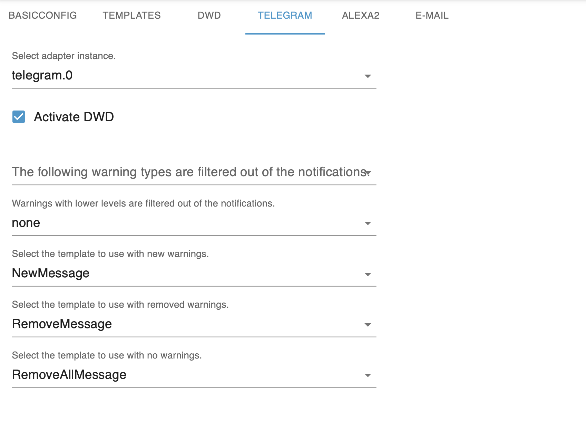

# ioBroker.weather-warnings

**Tests:** 

## weather-warnings adapter for ioBroker

Dieser Adapter ruft Wetterwarnungen verschiedener optionaler Dienste ab und gibt diese als Textnachricht oder Sprachnachrichten aus. Zusätzlich werden nach Typ gruppierte States bereitgestellt, mit denen man auf aktuelle Warnlagen reagieren kann.
## Installation
Nach der Installation und dem automatischen öffnen der Konfigurationsseite diese **nochmals reloaden**. Damit werden die Vorlagen in der eingestellten Sprache angezeigt.

## Konfiguration

- **Activate DWD/UWZ/ZAMG:** aktiviere den Datenabruf von diesen Dienstleistern
- **Activate telegram/pushover,...:** aktiviere die Ausgabe von Nachrichten an diese installierten Adapter. 
- **Activate email:** Schreibt alle aktuellen Warnungen in eine Email.
- **Activate history:** schreibt in den State: .history einen Verlauf der bis zu 500 Einträgen beinhalten kann. Alle Daten oder ausgewählte.
- **Activate json-array:** sehr spezielle, schreibt die aktuellen Warnungen in ein Array oder nach Aktivierung ein benutzerdefiniertes Json in ein Array, das von Skripten ausgewertet werden kann.

- **Update interval:** Abrufinterval in Minuten zu dem Daten geladen werden. (minimum: 5)

- **Incoming warnings...:** Nach dem Adapterstart werden die beim ersten Datenabruf erhaltenen Warnungen als bekannt angesehen und lösen keine Benachrichtigung aus.

- **Testing- Activate...:** Use testdata. Adapter is offline.

- **Testing- Raw data history:** Für Debugging, nur nach Aufforderung.

Hier kannst du eigenen Nachrichten erstellen, oder vorhandene anpassen. Unterhalb der Tabelle stehen alle verfügbare "Tokens" und was sie bedeuten. Der Unique identifier wird in den Pushdiensten verwendet, um einzustellen welche Vorlage mit welcher Meldungsart verwendet werden soll.

Zeichen mit besonderer Bedeutung:
- `${}` umfasst Tokens die aufgelöst werden. Der Vorlagenbezeichner kann hier ebenfalls eingesetzt werden.
- Vorlagenbezeichner die mit `_` beginnen, werden bei Diensten nicht angeboten.
- `${[0,1,2,3,4]token}` Eine Zeichenkette mit Werten, token muß ein Zahlentoken sein. Index ist wie im Beispiel. 0 ist der erste Wert in der Liste
- bei einer Vorlage für Jsons muß das abschließende `}` so geschrieben werden `\}`
- siehe Beispiele im Adapter.

**Restore Templates:** Setzt die Vorlagen auf die aktuelle Systemsprache zurück. Vorhandene Vorlagen gehen **verloren**. Anschließend speichern & schließen. Sollte ebenfalls verwendet werden, wenn die Systemsprache geändert wurde.

**DWD:** Die Auswahl erfolgt nach einer Liste von 10000 Orten, nach der Eingabe in ein anderes Feld klicken und wieder zurück gehen, die Liste ist zu groß und muß aktualisiert werden.

**UWZ:** Eingabe erfolgt mit Ladenkennzeichen DE AT (weitere möglich muß man ausprobieren) und der Postleitzahl, also DE12345

**ZAMG:** Nur für Österreich. Eingabe von Koordinaten die in Österreich liegen.

**Place name:** benutzerdefinierte Ortsbezeichnung, kann in Warnungen verwendet werden. (Nützlich bei mehreren Warncellen)

**Adapter:** Wenn diese Möglichkeit aktiviert wurde und es ein Adapterfeld gibt muß dort einen gültige Auswahl getroffen werden. Eine Fehlermeldung im Log weißt auf fehlende Einstellungen hin. 

**Activate ...:** Versende Warnungen von diesem Anbieter mit diesem Dienst.

**Filter:** 
1) Ignoriere Warnungen mit diesem Type
2) Ignoriere Warnungen mit einem gleichen oder geringeren Level

**Messages:** verwende folgende Vorlagen für:
1) Neue Warnungen oder bestehende Warnungen
2) Eine Warnung wurde entfernt und es gibt **noch** weitere Aktive.
3) Warnungen wurden entfernt und es gibt **keine** weiteren Aktiven.

**Besonderheiten**

**email:** Header wird vor die Mail gestellt, dann kommt wiederholt: 1,2 oder 3 +  Zeilenumbruch und anschließend Footer.(weitere Funktionen in Arbeit)

**alexa:** Zusätzlich muß hier noch ein/mehrere Geräte ausgewählt werden.

Vorlagen für 3) können keine ${} Tokens enthalten, da für diese Nachricht mehrere Warnungen in Frage kommen.

## Icons
https://icon-icons.com/de/symbol/Wetter-wind-cloud-Blitz-Regen/189105

## Changelog
<!--
	Placeholder for the next version (at the beginning of the line):
	### **WORK IN PROGRESS**
-->
### 0.3.2 (2023-10-10)
* add alexa volumen

### 0.3.1 (2023-10-10)
* (ticaki) added alexa

### 0.3.0 (2023-10-03)
* (ticaki) added multiple warncell
* added option to remove channels
* fixed alot bugs

### 0.2.6-alpha.0 (2023-10-02)
* (ticaki) added email, json, history
* add more template key
* add mulitple dwd warncells
* fixed alot bugs

### 0.2.5-alpha.0 (2023-09-30)
* (ticaki) added telegram, whatsapp, pushover
* added remove all
* added json/array output for all current warnings.

### 0.2.4-alpha.0 (2023-09-29)
* (ticaki) add alerts

### 0.2.3-alpha.0 (2023-09-28)
* (ticaki) more translations
* filter warn type, generic warntypes
* more prebuild tests

### 0.2.2-alpha1.0 (2023-09-26)
* (ticaki) more CustomTokens,
* translations for warntypes, warnlevelcolor,
* total active warningcountshttps://github.com/ticaki/ioBroker.weather-warnings
* remove old warnings

### 0.2.1-alpha.0 (2023-09-25)
* (ticaki) initial release

## License
MIT License

Copyright (c) 2023 ticaki <github@renopoint.de>

Permission is hereby granted, free of charge, to any person obtaining a copy
of this software and associated documentation files (the "Software"), to deal
in the Software without restriction, including without limitation the rights
to use, copy, modify, merge, publish, distribute, sublicense, and/or sell
copies of the Software, and to permit persons to whom the Software is
furnished to do so, subject to the following conditions:

The above copyright notice and this permission notice shall be included in all
copies or substantial portions of the Software.

THE SOFTWARE IS PROVIDED "AS IS", WITHOUT WARRANTY OF ANY KIND, EXPRESS OR
IMPLIED, INCLUDING BUT NOT LIMITED TO THE WARRANTIES OF MERCHANTABILITY,
FITNESS FOR A PARTICULAR PURPOSE AND NONINFRINGEMENT. IN NO EVENT SHALL THE
AUTHORS OR COPYRIGHT HOLDERS BE LIABLE FOR ANY CLAIM, DAMAGES OR OTHER
LIABILITY, WHETHER IN AN ACTION OF CONTRACT, TORT OR OTHERWISE, ARISING FROM,
OUT OF OR IN CONNECTION WITH THE SOFTWARE OR THE USE OR OTHER DEALINGS IN THE
SOFTWARE.